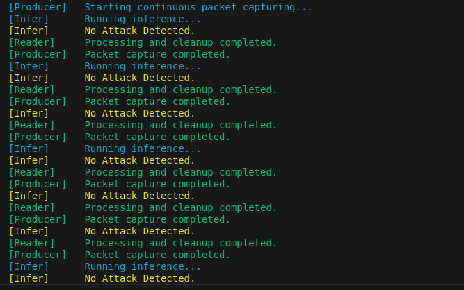

# RealTime_IDS

A real-time intrusion detection system (IDS) built using Python. This project aims to enhance network security by monitoring and analyzing traffic patterns to detect potential threats.

## Authors

- [rohitjoshi21](https://github.com/rohitjoshi21)
- [NayanPandey371](https://github.com/NayanPandey371)
- [Nir-Roman](https://github.com/Nir-Roman)

## Features

- Real-time monitoring of network traffic
- Anomaly detection using machine learning algorithms
- Easy-to-use interface

## Installation

1. Clone the repository:
   > git clone https://github.com/rohitjoshi21/RealTime_IDS.git

2. Navigate to the project directory:
   > cd RealTime_IDS

3. Set up a virtual environment and install dependencies:
   > pip install -r requirements.txt

4. Install `cicflowmeter` using Poetry:
   ```
   git clone https://github.com/hieulw/cicflowmeter
   cd cicflowmeter
   poetry install
   ```

## Usage

1. Update the `cicflowmeter` path and Wi-Fi interface name in `main.py`.
2. Run the main script with root privileges to start monitoring:
   > sudo python main.py

## Screenshot



## Project Structure

RealTime_IDS/
├── docs/            # Documentation files
├── src/             # Source code
│   ├── main.py      # Main entry point for the application
│   └── ...          # Other source files
├── tests/           # Testing scripts
├── requirements.txt  # List of dependencies
└── README.md        # Project documentation

## Contributing

Contributions are welcome! Please open an issue or submit a pull request for any improvements or suggestions.

## License

This project is licensed under the MIT License.

## Contact

For inquiries or feedback, please reach out to rohitjoshi21.
